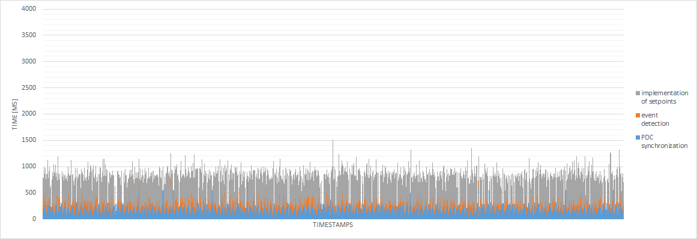
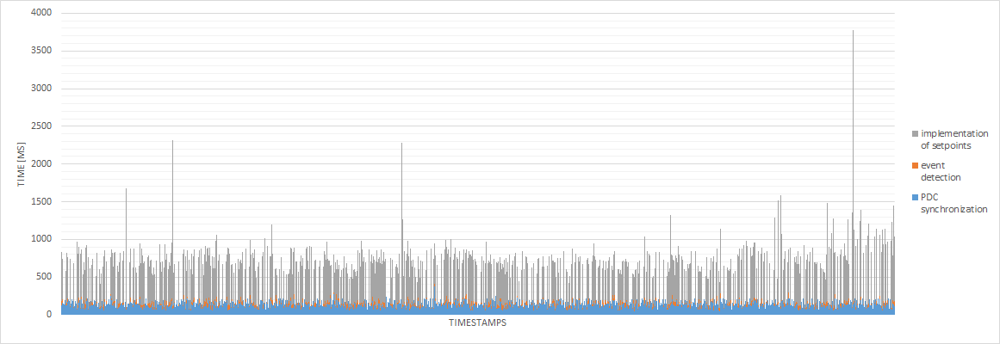
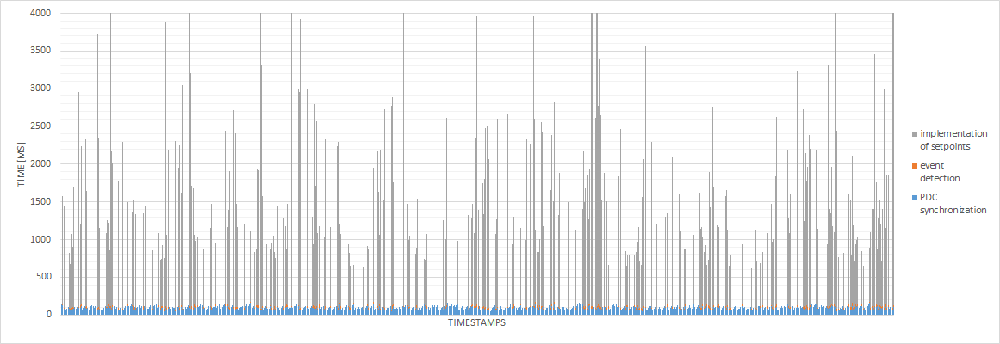

# Microgrid service

This repository describes of Microgrid controller setup using FIWARE. The repo contains necessary software elements in order to build the setup, however it is also based on RTDS simulation and uses with low-cost phasor measurement unit, therefore in order to build the setup with all functionalities, the following should be available:
* RTDS for microgrid simulation, including GTAO analog card to connect the PMU and a virtual machine functioning as a bridge between the GTAO card and other components,
* PMU device for measuring phasors of the grid.

**Docker container setup**\
8 containers are necessary to run the setup: 
- IoT Agent
- Quantum Leap
- Orion CB
- Grafana
- Mosquitto
- Mongo DB
- Crate DB
- MG Controller

The first 7 containers are well-known elements of a FIWARE implementation such as the one described in the following tutorials: 
- https://fiware-tutorials.readthedocs.io/en/1.0.0/iot-over-mqtt/index.html
- https://fiware-tutorials.readthedocs.io/en/latest/time-series-data/index.html

Final docker is the controller container, which cooperate with other containers. The following scheme describes how it is located with respect to other elements.

\
**Figure 1**: Overview of the cloud setup (based on figure in Fiware Time Seried Data tutorial)

The IoT devices of the setup are the following: (1) Phasor measurement unit (PMU), which is the IoT device in form of a physical hardware that communicates measurements to the cloud through publishing MQTT messages and (2) RTDSvm, which is a virtual machine (i.e. non-physical entity) that forwards measurements or control settings from and to the enviornment in RTDS simulator, respectively. The virtual machine emulates multiple devices, both those suppyling meter data to the cloud as well as those receiving setpoint from the controller (i.e. actuators). The measurements data are sent using IoT Agent, Mosquitto Broker, stored in Mongo/Crate DB, and through subsriptions of Quantum Leap also avialable in Grafana for visualisation. Similarly with the output of MG controller i.e. control setpoints for inverters and circuit breakers of loads. 

**MG controller**\
MG Controller container is implemented in Python 3. 
It has an additional connection to the IoT agent (additional with respect to the setup in "IoT over MQTT Tutorial") in order to send or receive the measurements 
in sub-second intervals (connection marked as dashed line in the Fig. 1). Due to dynamics of the phenomena in islanded microgrid (fast electrical waveforms), 
a frequent and quick communication is necessary. 

Microgrid secondary control (frequency control):
MG controller in the presented setup, provides event-based secondary frequency control in an islanded microgrid with three inverters 
(grid forming, grid feeding and grid supporting) and loads. Dynamic conditions are emulated through connection and disconnection of 
loads (eventually through modifying their dynamic load values). 
The controller service running in the cloud needs to therefore exectue the following basic tasks:
* Synchronize the measurements including phasors from different sources (PDC - phasor data concentrator, as recommended by standard [4])
* Detect whether any load quick shedding action needs to be taken by the controller and take an action (event-based Disturbance Detector)
* Continously derive setpoints for inverters for accurate power sharing (continouse MGCC) and send them to inverters.

In order to check the performance of the platform, the first two tasks are mainly exploited (see some observations from tests below).

**RTDS environment**\
Real-time digital simulator (RTDS) simulates a islanded microgrid with 3 distributed generators run by 3 inverters. 
In the folder grid_model one can find the model of microgrid. It is configured for communication with the RTDSvm, which is responsible 
for further, bi-directional communication with the cloud.

**PMU**\
Phasor Measurement Unit used in the setup is the extended version of low-cost PMU developed in ACS of RWTH Aachen. 
The complete basic version of the PMU software is published: https://www.fein-aachen.org/en/projects/, 
while the extension-development developed for the purpose of this setup is included in the pmu folder. 
As the result, PMU can act as IoT device and publish messages into the cloud with higher reporting rate.

PMU calculates the phasors using Modulated Sliding Enchanced Interpolated DFT based on [1]-[3] as a state of the art phasor estimation algorithm. 
It is therefore able to calculate magnitude, frequency, RoCoF as required by c37.118 [4] and these data are then sent and used by the controller. 
The algorithm has been implemented with the purposed of very high reporting rate (reporting of measurement data to the controller in the cloud) 
and thus the PMU is able to calculate and publish to the broker up to 50 frames (aforementioned sets of measurements) per second.

**Observations**\
Due to the nature of electrical grid with high dynamics (like islanded microgrid), the main purpose of this setup is to investigate how the FIWARE 
powered cloud can handle a service requiring relatively quick communication (low communication latency). Figures 2-4 present 3 main delays in operation
based on timestamps measured at different stages (from meters through cloud-controller, up to execution of control settings). 

The setup was tuned through the parameters such as
reporting rates of different devices (PMU and RTDS-based), PDC synchronization frequency and range, PDC memory buffer, controller execution frequency etc. in order to 
handle 3 cases when the devices report with frequency of 4 measurements/second (4Hz), 10 measurements/second (10Hz) and 25 measurements/second (25Hz).

\
**Figure 2**: 3 main delays for reporting rate 4 measurements / second.

\
**Figure 3**: 3 main delays for reporting rate 10 measurements / second.

\
**Figure 4**: 3 main delays for reporting rate 25 measurements / second.

The operation using FIWARE deteriorates when measurements are published more often most probably due to Orion CB and other FIWARE components where the congestions appear. 
It was not identified what exactly causes the delays in case of high reporting rate (which element in FIWARE). At for reporting rates above 25Hz the cloud 
doesn't respond i.e. it is not possible for the controller to transmit the setpoints back to the devices. On the other hand, we can observe that the delays 
of PDC and controller detector (blue and orange) decrease with higher reporting rate, as expected. The PDC and controller are then also running
with the higher frequency, PDC is able to synchronize new data more frequently, and therefore the overall delay of a single measurements + synchronization + detection 
event is lower.

Entire "theoretical" total delay can include following components:
- delay due to the windowing of signal and measurement time tag in the center of the acquisition window (can be decreased for reaching higher reporting rate but lower accuracy)
- PMU / other device processing time (e.g. due to anialiasing filters in PMU etc.)
- delay due to limited reporting rate. It is determined by performance of the device and implemented algorithm.
- communication latency delay incl. delay due to the packet dropouts - can appear especially in the communication between controller and an actuator since the control settings have to be delievered to the device and the TCP protocol is used. It does not appear in communication sensor to controller (due to UDP), however it might cause delay in phasor data concentrator,
- delay in phasor data concentrator (PDC) due to its operational settings and eventual processing of missing data accroding to a fixed waiting interval.
- delay in disturbance detector and MG controller or other controllers,
- communication latency, packet dropouts delays in communication "back" from controller to actuator.

**Networking and encryption**\
The components of the setup have been implemented inside of a laboratory consiting of multiple networks. 
The components are connected to a single setup through tunneling of a configured OpenVPN network, which can also correspond to a real-world implementation due to 256-bit OpenSSL encryption for communication between the meters and the cloud.
No wireless communication has been implemented in the current setup.

**References**\
[1] P. Romano and M. Paolone, "Enhanced Interpolated-DFT for Synchrophasor Estimation in FPGAs: Theory, Implementation, and Validation of a PMU Prototype," in IEEE Transactions on Instrumentation and Measurement, vol. 63, no. 12, pp. 2824-2836, Dec. 2014, doi: 10.1109/TIM.2014.2321463.\
[2] P. Romano and M. Paolone, "An enhanced interpolated-modulated sliding DFT for high reporting rate PMUs," 2014 IEEE International Workshop on Applied Measurements for Power Systems Proceedings (AMPS), Aachen, 2014, pp. 1-6, doi: 10.1109/AMPS.2014.6947708.\
[3] A. Derviškadić et al., "Iterative-Interpolated DFT for Synchrophasor Estimation: A Single Algorithm for P- and M-Class Compliant PMUs," in IEEE Transactions on Instrumentation and Measurement, vol. 67, no. 3, pp. 547-558, March 2018, doi: 10.1109/TIM.2017.2779378.\
[4] IEEE Standard for Synchrophasor Data Transfer for Power Systems," in IEEE Std C37.118.2-2011 (Revision of IEEE Std C37.118-2005) , vol., no., pp.1-53, 28 Dec. 2011, doi: 10.1109/IEEESTD.2011.6111222.\
